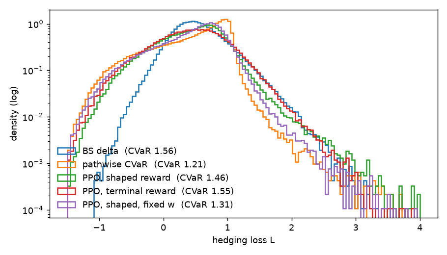
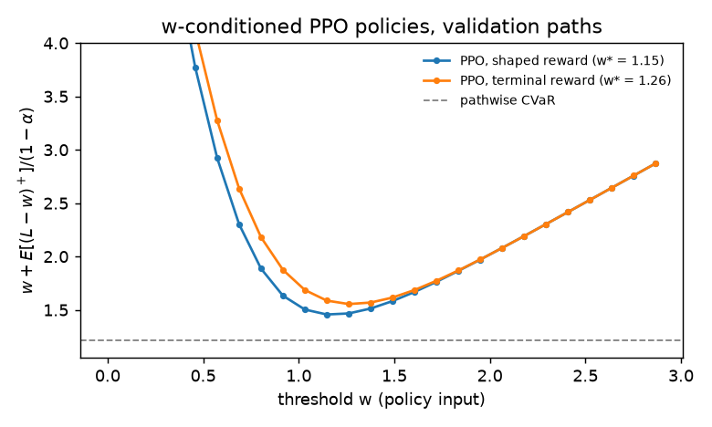
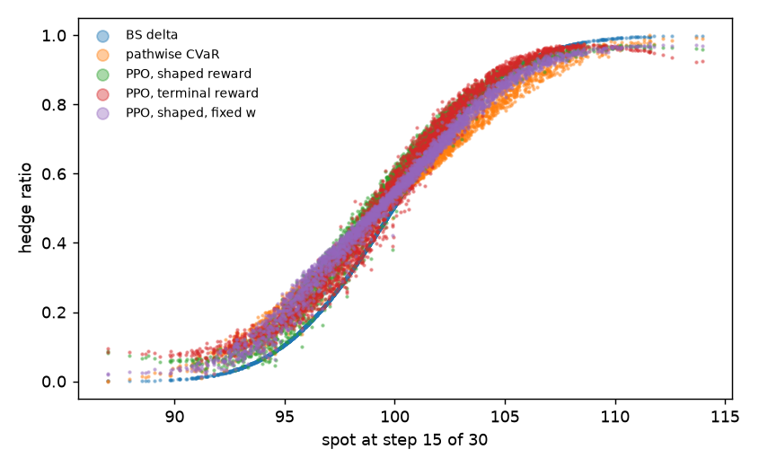
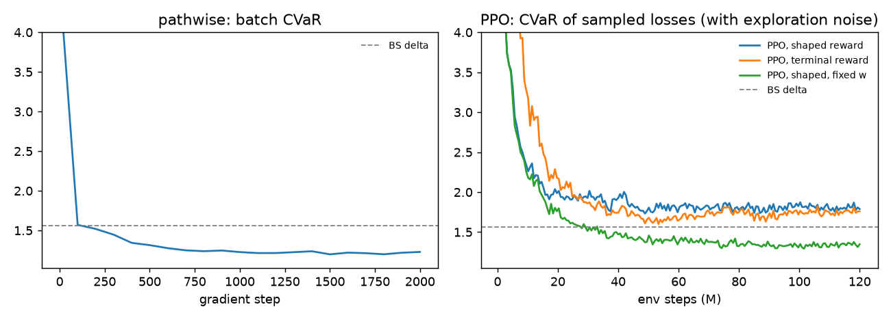

# Deep hedging under CVaR with PufferLib

A self-contained exploration that has nothing to do with the rest of this repo.

**Question.** Can PPO, trained through PufferLib, learn a CVaR-optimal hedge
for a short call with transaction costs? How does it compare with the
standard deep hedging method of Buehler, Gonon, Teichmann and Wood (2019),
which backpropagates the risk measure through simulated paths?

## Setup

- Market: geometric Brownian motion, `S0 = K = 100`, `sigma = 0.2`, zero drift and rates.
- Contract: a short at-the-money European call with 30 days to expiry, hedged
  daily (30 rebalancing dates). The premium is the Black-Scholes price (2.287).
- Proportional transaction cost `c = 0.002`, charged on every trade,
  including the initial purchase and the liquidation at expiry
  (`delta_{-1} = delta_n = 0`, as in Buehler et al.).
- Objective: minimize `CVaR_0.95(L)`, where `L = -PnL` is the hedging loss. We use
  the Rockafellar-Uryasev form
  `CVaR_alpha(L) = min_w  w + E[(L - w)^+] / (1 - alpha)`.

### Hedgers

| hedger | how it is trained |
|---|---|
| BS delta | Black-Scholes delta, ignoring costs |
| pathwise CVaR | Deep hedging: minimize the RU objective jointly over the network and `w` by backpropagating through 16384 simulated paths in each step (Adam, 2000 steps) |
| PPO (PufferLib) | Our env + `pufferlib.pufferl.PuffeRL`, 4096 parallel paths, 120M env steps |

All networks share the same input: time, scaled log-moneyness, previous
hedge, accumulated wealth, `w`, and `w + wealth`. Each is an MLP with two
hidden layers of width 64 (`policy.py`).

### Making CVaR fit an RL objective

CVaR is not an expected sum of rewards, so PPO cannot optimize it directly.
We use the state augmentation of Bäuerle & Ott (2011). For a fixed `w`, the inner
problem `min E[(L - w)^+]` is an ordinary expected terminal cost, provided
the accumulated wealth is part of the state. The env samples
`w ~ U[0, 0.5] * sigma sqrt(T) S0` at the start of every episode and puts
it in the observation. One policy `pi(a | s, w)` therefore covers all thresholds.
After training, the outer minimization over `w` is a 1-D grid search on
validation paths (`results/ru_objective.png`).

Two reward choices (`env.py`):

- **terminal**: the only reward is `-(L - w)^+ / scale`, paid at expiry.
- **shaped** (default): potential-based shaping (Ng, Harada & Russell, 1999).
  The potential is `Phi(s_k) = -(Lhat_k - w)^+ / scale`, where `Lhat_k` is the
  Black-Scholes mark-to-market loss of closing out at date `k`. At expiry,
  `Phi` equals the true terminal reward, so the shaped rewards telescope to
  it (checked numerically to 2e-7). With `gamma = 1` the optimal policy
  is unchanged.

### PufferLib details worth knowing

- `PuffeRL.evaluate` clamps rewards to `[-1, 1]`, so rewards are divided by
  `sigma sqrt(T) S0 ≈ 5.73`. The env logs `reward_clipped_frac`, which is 0
  after the first few million steps.
- The advantage kernel (`compute_puff_advantage`) runs within each
  `bptt_horizon` segment and never looks across segments. A terminal reward
  landing in the next segment would be silently dropped. The env therefore
  runs synchronized episodes of `n + 1` steps (`n` decisions, then one step
  that resets), with `bptt_horizon = n + 1`, so each segment holds exactly one
  episode. The policy masks its value to 0 on the post-expiry observation.
- The trainer uses Adam, `gamma = 1`, `gae_lambda = 0.95`, 4 update epochs,
  8 minibatches, and `prio_alpha = 0`, which turns PufferLib's prioritized
  segment sampling into plain uniform PPO.
- PufferLib 3.0.0's `setup.py` breaks with `NO_OCEAN=1`; `setup.sh` patches it.
  Without a GPU it builds the C++ CPU advantage kernel only.

## Results

Scores are on 200k test paths not used for training or for choosing `w`
(`results/summary.md`). Learned policies act with their mean action.

| strategy | mean | std | VaR0.95 | CVaR0.95 | w |
|---|---|---|---|---|---|
| no hedge | 0.007 | 3.470 | 7.460 | 10.134 | – |
| BS delta | 0.547 | 0.409 | 1.278 | 1.563 | – |
| pathwise CVaR | 0.445 | 0.561 | 1.061 | **1.215** | 1.062 |
| PPO, terminal reward | 0.421 | 0.549 | 1.276 | 1.552 | 1.261 |
| PPO, shaped reward | 0.440 | 0.507 | 1.153 | 1.455 | 1.147 |
| PPO, shaped, fixed w | 0.430 | 0.519 | 1.095 | 1.311 | 1.061 |



What we see:

1. **PPO through PufferLib learns a CVaR hedge that beats BS delta**, but only
   with reward shaping. Terminal-only PPO matches BS delta (1.55 vs 1.56).
   Shaping lowers CVaR to 1.46, and its training curve falls faster over the
   first ~20M steps.
2. **Conditioning on `w` costs a lot.** Fixing `w` at the pathwise optimum
   (1.06) during training brings PPO to 1.31, most of the way to pathwise
   (1.22). The `w`-conditioned policy has to be good across the whole threshold
   range, while only `w` near `w*` matters for the final hedge. This
   comparison favors the fixed-`w` run, because it borrows `w*` from the
   pathwise solution. Without that information, one would need an outer loop
   over `w` (e.g. a few runs, or updating `w` from the empirical VaR of
   the current losses).
3. **Pathwise is still the best and far more sample efficient**. It uses exact
   gradients of the P&L with respect to the hedge, which PPO does not.
   Pathwise saw about 33M paths, i.e. 1B simulated steps, in ~10 min on 2
   threads. PPO took 120M steps (3.9M episodes) in 10–15 min. Pathwise needs
   the P&L to be differentiable in the hedge positions, not in the market
   model: prices here do not react to the hedger, so paths from any generator,
   or from historical data, work. PPO earns its place when that fails. Examples
   are price impact from a black-box simulator, fixed costs on every trade
   (zero gradient almost everywhere), discrete decisions such as order fills
   or lot sizes, and long horizons where backpropagated gradients explode.
4. Every CVaR hedger gives up mean loss to cut the tail. The learned hedges
   hold more stock than BS delta when the option is out of the money, and
   they stay below 1 deep in the money. At a given spot they spread
   vertically because they depend on accumulated wealth, which BS delta
   ignores (`results/hedge_ratio.png`).





The training curves are CVaR of the losses sampled during training, with
exploration noise. For the `w`-conditioned runs they also mix all thresholds,
so they sit above the test numbers and are not comparable to the fixed-`w`
curve.

Caveats: one seed per configuration, no hyperparameter search, and PPO's
policy standard deviation collapses to about 0.01 by the end, so later steps
explore little.

## Next steps

- Outer loop over `w` without borrowing it from the pathwise run. For example,
  narrow the `w` sampling range around the empirical VaR of recent losses.
- Seeds, cost levels (`--cost`), and CVaR levels; Heston dynamics, where the
  variance becomes part of the state.
- Recurrent or wealth-free policies, to test how much the wealth input matters.
- Larger sweeps could run in separate cloud sessions. This container has only
  4 cores, so parallel runs here just contend for them.

## Reproduce

```bash
./setup.sh                                  # venv with torch 2.7.1 + PufferLib 3.0.0 (CPU)
source .venv/bin/activate
python train_pathwise.py --iters 2000       # results/pathwise.pt
python train_ppo.py --timesteps 120000000   # results/ppo.pt (shaped)
python train_ppo.py --timesteps 120000000 --no-shaping --out results/ppo_terminal.pt
python train_ppo.py --timesteps 120000000 --w-low 0.185 --w-high 0.185 --out results/ppo_fixed_w.pt
python evaluate.py                          # table + plots in results/
```

| file | contents |
|---|---|
| `hedging.py` | GBM paths, Black-Scholes, observation, P&L, VaR/CVaR, RU objective |
| `env.py` | `HedgingEnv`, a native `pufferlib.PufferEnv` with augmented state and shaping |
| `policy.py` | Gaussian actor-critic in PufferLib's policy contract |
| `train_pathwise.py` | Deep hedging baseline |
| `train_ppo.py` | PPO via `pufferlib.pufferl.PuffeRL` |
| `evaluate.py` | Grid search over `w`, test scores, plots |

## References

- H. Buehler, L. Gonon, J. Teichmann, B. Wood. Deep hedging. *Quantitative Finance* 19(8), 2019.
- R. T. Rockafellar, S. Uryasev. Optimization of conditional value-at-risk. *Journal of Risk* 2(3), 2000.
- N. Bäuerle, J. Ott. Markov decision processes with average-value-at-risk criteria. *Math. Methods of Operations Research* 74, 2011.
- A. Y. Ng, D. Harada, S. Russell. Policy invariance under reward transformations: theory and application to reward shaping. *ICML* 1999.
- J. Suarez. PufferLib. https://github.com/PufferAI/PufferLib
