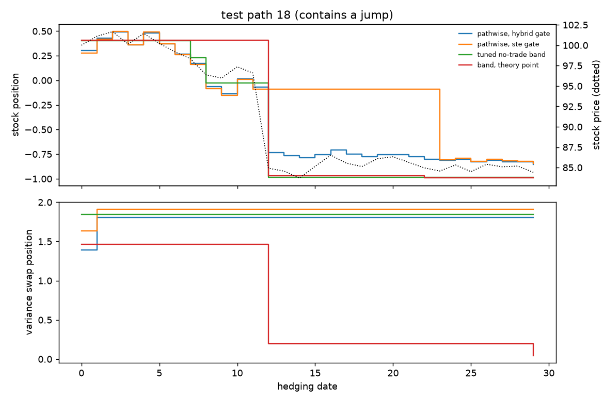
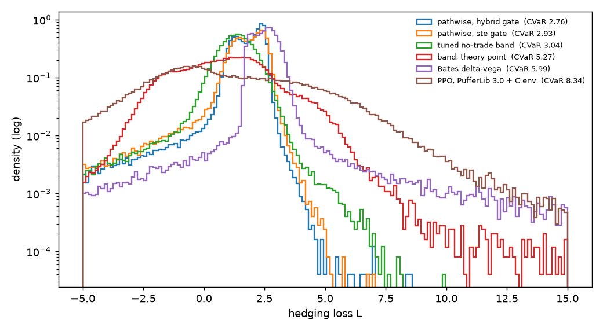
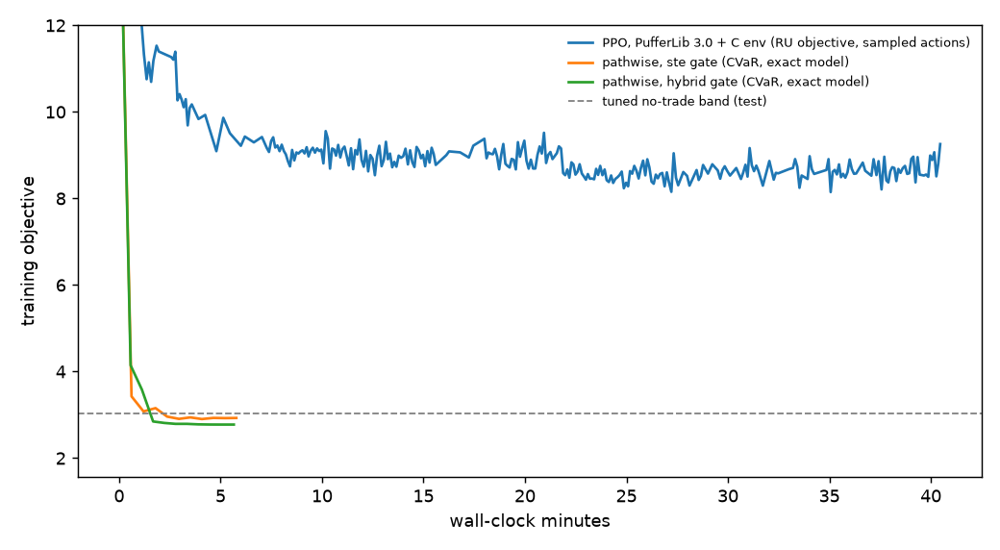

# Part 3: a short option book under Bates dynamics

Parts 1 and 2 hedged one call under geometric Brownian motion with a
single hedging instrument. Here the market and the baselines are both
harder.

**Market** (`market.py`):
- **Dynamics:** Bates (1996), i.e. Heston stochastic variance with leverage
  (ρ = −0.7, vol of vol 0.6) plus lognormal crash jumps (rate 2 a year, mean
  −6%). Simulated with full-truncation Euler on 4 substeps a day.
- **Book:** short one 100-strike call and one 95-strike put, 30 days, hedged
  daily, priced at inception with the Lewis Fourier formula.
- **Two instruments:**
  - the stock, with transient price impact, proportional cost and a fixed fee;
  - a variance swap on daily log-returns, traded at its model value, with a
    cost for each contract and the fee.
- **Decisions:** 4 actions, a target and a trade signal for each instrument.
  An instrument trades to its target only when its signal is positive.
- **Objective:** CVaR at 95% of the loss, written in its
  Rockafellar–Uryasev form.

**One C env** (`hedge.h`), with no Cython:
- **Two wrappers:** PufferLib 3.0's native binding (`binding.c`, CPU) and
  PufferLib 5.0's env API (`puffer5/deep_hedging.h`, CUDA trainer).
- **`test_c.py`:**
  - the core matches `market.py` on identical noise and actions: losses to
    4e-13, observations to 6e-8, rewards to float32;
  - its own generator reproduces the Fourier option prices and the variance
    swap strike within 1.5 standard errors;
  - the 3.0 binding steps bit-for-bit like the core.
- **`puffer5/test_wrapper.c`:** the 5.0 wrapper also steps bit-for-bit like
  the core.

## Baselines

All tuning uses validation paths (seed 999). Every method is scored once on
the same 200k test paths (seed 12345), with deterministic actions.

| baseline | what it is | tuning |
|---|---|---|
| BS delta | book delta at the initial vol, stock only, daily | none |
| Bates delta (plain, minimum-variance) | model delta from Fourier greeks (`greeks.py`), stock only, daily | none |
| Bates delta-vega | model delta in stock, plus `y* = (dB/dv)/(dV/dv)` variance swaps, daily | none |
| no-trade band | band around the delta-vega targets with gamma/vanna/volga-based widths: Whalley–Wilmott (proportional) and Altarovici–Muhle-Karbe–Soner (fixed cost) terms, partial adjustment, target multipliers | 8 constants, Optuna TPE, 32 trials |
| pathwise deep hedging, straight-through | backprop through `market.simulate`; exact forward pass, sigmoid gradient for trade decisions | none (GPU sweep in the notebook) |
| pathwise deep hedging, hybrid | pathwise gradient for targets plus score-function gradient for sampled trade decisions (Schulman et al. 2015), leave-one-out baseline over 4 samples (Kool et al. 2019); deterministic at test | none (GPU sweep in the notebook) |

The hybrid estimator was checked against an exact enumeration of all
decision sequences on a 2-date book. Its error stays within Monte Carlo
error; without the score term the error is 33 times larger
(`test_pathwise.py`).

## Results on CPU

Training ran on 4 CPU threads in this container. PPO is PufferLib 3.0 with
the C env, untuned (Adam, 200M steps).

| strategy | val CVaR95 | test mean | std | VaR95 | **test CVaR95** | stock trades | swap trades | train time (s) | sim steps |
|---|---|---|---|---|---|---|---|---|---|
| no hedge | 10.57 | 0.00 | 3.89 | 7.12 | 10.65 | 0 | 0 | – | – |
| BS delta | 13.09 | 1.74 | 3.20 | 6.84 | 13.16 | 30 | 0 | – | – |
| Bates delta | 13.58 | 1.72 | 3.34 | 7.14 | 13.66 | 30 | 0 | – | – |
| Bates min-variance delta | 12.48 | 1.69 | 3.02 | 6.32 | 12.51 | 30 | 0 | – | – |
| Bates delta-vega | 6.08 | 2.50 | 2.04 | 3.45 | 5.99 | 30 | 30 | – | – |
| band, theory constants | 5.30 | 0.81 | 2.13 | 4.16 | 5.27 | 3.2 | 1.6 | – | – |
| **tuned no-trade band** | 3.05 | 1.10 | 2.06 | 2.56 | **3.04** | 7.4 | 1.0 | 93 (tuning) | 96M |
| PPO, PufferLib 3.0 + C env | 8.36 | 0.26 | 5.25 | 6.46 | 8.34 | 1.0 | 1.0 | 2429 | 200M |
| pathwise, straight-through | 2.93 | 1.51 | 2.12 | 2.71 | 2.93 | 26.9 | 1.7 | 347 | 246M |
| **pathwise, hybrid** | 2.76 | 1.57 | 1.90 | 2.59 | **2.76** | 28.0 | 2.7 | 339 | 246M |

What we see:

1. **Delta hedging alone is worse than not hedging.** The book is short a
   put, so its delta hedge is long stock. A crash jump hits the put and the
   hedge together. Only the variance swap, whose realized variance jumps in
   a crash, offsets that risk: daily delta-vega roughly halves CVaR.
2. **Costs matter as much as the model.** The tuned band holds a static
   variance swap position (about 1.3 × y*) and rebalances stock 7 times in
   an episode. That cuts CVaR from 6.0 to 3.0, and tuning alone takes the
   theory constants from 5.3 to 3.0.
3. **Pathwise deep hedging beats the tuned band** (2.76 vs 3.04) in about 6
   minutes of CPU training. Exact gradients for the targets plus a
   score-function term for the trade decisions work better than the
   straight-through approximation (2.93). Both trade the stock almost every
   date in small amounts, and hold the swap.
4. **Untuned PPO fails here** (8.34). It learns to trade each instrument
   about once, i.e. a near-static hedge, and stays there (`results/cpu/training.png`).
   Exploration is the likely culprit. A Gaussian trade signal makes random
   trades costly early on (a fee each time), so PPO pushes the signal down
   and rarely explores rebalancing again. PufferLib 5.0 on a GPU with a
   hyperparameter sweep (`puffer5/colab.ipynb`) is the next test.





## GPU and sweeps

`puffer5/colab.ipynb`, generated by `puffer5/make_notebook.py`, runs on a
Colab GPU:
- builds PufferLib 5.0 (pinned commit) with `hedge.h` compiled in;
- runs the three equivalence tests;
- trains PPO for 200M and 1B steps;
- sweeps PPO with PufferLib's Protein (`puffer5/sweep.ini`), with the top
  runs re-scored on validation (`puffer5/select_sweep.py`);
- tunes the band and sweeps hybrid pathwise with the same number of trials;
- scores everything with `evaluate.py`.

The 5.0 env uses 12 observations and 4 actions, so no PufferNet tensor
needs padding. That sidesteps the misalignment in PufferLib 5.0's Muon step
documented in part 2.

## Reproduce (CPU)

```bash
source ../.venv/bin/activate && pip install optuna
python setup.py build_ext --inplace     # C env for PufferLib 3.0
python test_c.py                        # core vs market.py, binding vs core
python test_greeks.py && python test_pathwise.py
python train_ppo.py                     # results/ppo.pt
python tune_baselines.py --trials 32 --device cpu --out results/baselines.json
for g in ste hybrid; do python train_pathwise.py --gate $g --iters 1000 --batch 8192; done
python evaluate.py --device cpu --out results/cpu --runs "baselines|baselines|results/baselines.json" \
  "ppo3|PPO, PufferLib 3.0 + C env|results/ppo.pt" "pathwise|pathwise, ste gate|results/pathwise_ste.pt" \
  "pathwise|pathwise, hybrid gate|results/pathwise_hybrid.pt"
```

## References

- D. Bates, *Jumps and stochastic volatility: exchange rate processes
  implicit in Deutsche mark options*, Rev. Financial Studies 9, 1996.
- S. Heston, *A closed-form solution for options with stochastic
  volatility*, Rev. Financial Studies 6, 1993.
- A. Lewis, *A simple option formula for general jump-diffusion and other
  exponential Lévy processes*, 2001.
- R. Lord, R. Koekkoek, D. van Dijk, *A comparison of biased simulation
  schemes for stochastic volatility models*, Quantitative Finance 10, 2010.
- A. E. Whalley, P. Wilmott, *An asymptotic analysis of an optimal hedging model for option
  pricing with transaction costs*, Math. Finance 7, 1997.
- A. Altarovici, J. Muhle-Karbe, H. M. Soner, *Asymptotics for fixed
  transaction costs*, Finance and Stochastics 19, 2015.
- N. Gârleanu, L. Pedersen, *Dynamic trading with predictable returns and
  transaction costs*, J. Finance 68, 2013.
- J. Schulman, N. Heess, T. Weber, P. Abbeel, *Gradient estimation using
  stochastic computation graphs*, NeurIPS 2015.
- W. Kool, H. van Hoof, M. Welling, *Buy 4 REINFORCE samples, get a
  baseline for free!*, 2019.
- Plus the references of parts 1 and 2.
