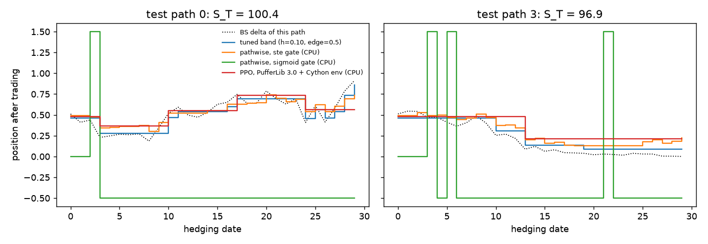
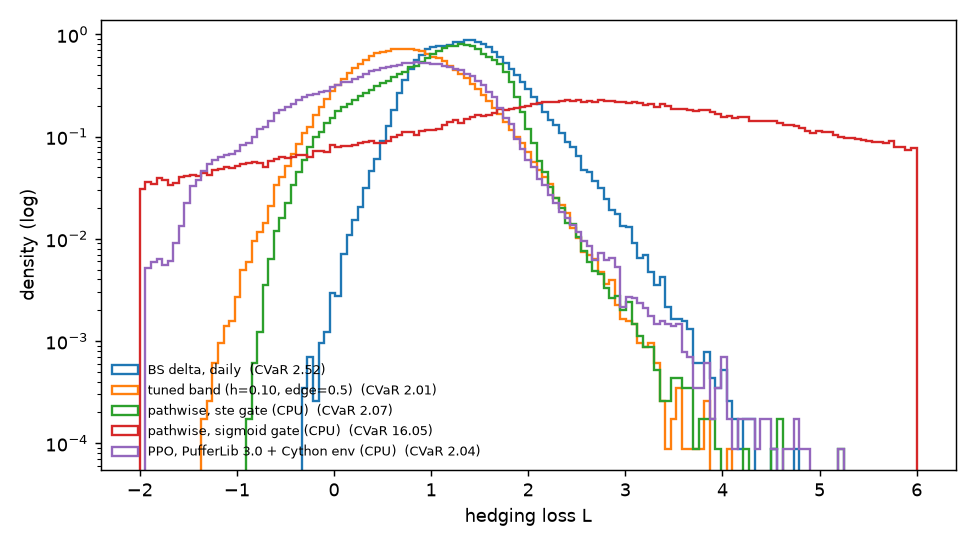
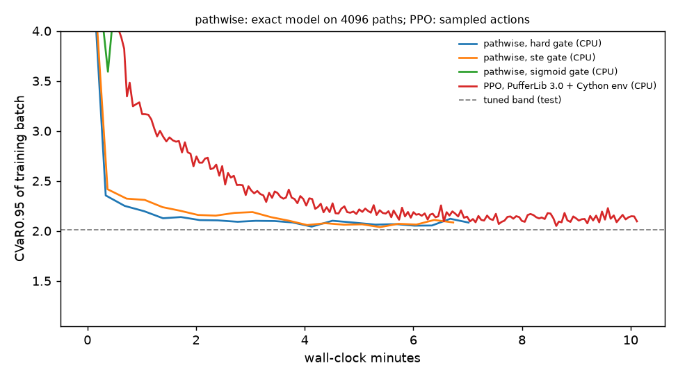

# Part 2: price impact and fixed costs

> **Superseded by part 3 (`../bates/`).** Part 3 has a richer market (Bates
> stochastic volatility with jumps, an option book, a variance swap as a
> second instrument), one C env shared by PufferLib 3.0 and 5.0, and
> stronger, model-based baselines. Part 2's Cython env, its benchmark and
> its PufferLib 5.0 port were removed; the results below were produced at
> commit `8e834f7`, where that code still exists. The PyTorch reference
> model (`market.py`), pathwise training and evaluation here still run.

Part 1 (`../README.md`) hedged a short call with proportional costs only.
There, pathwise deep hedging won clearly, because the P&L is differentiable
in the hedge. This part adds two frictions that break that advantage:

- **Transient price impact** (Obizhaeva & Wang 2013). Buying `q` shares
  costs `q S + κ q²/2`, pushes the quoted price up by `κ q`, and that push
  decays with a one-day half-life. Our own trades therefore move later
  prices, including the settlement price.
- **A fixed fee on every trade** (`f = 0.02`), on top of the proportional
  cost `c = 0.002`.

Everything else is as in part 1: GBM, a 30-day at-the-money call, daily
dates, and CVaR at 95% through the Rockafellar–Uryasev threshold `w`. The
action is now `(target position, trade signal)`, and the hedger trades only
when the signal is positive. `κ = 0.5` and `f = 0.02` were chosen so that
daily BS delta hedging is clearly suboptimal (CVaR 2.52) without the
frictions dominating everything.

## Implementations of the same model

| file | role |
|---|---|
| `market.py` | PyTorch reference model; pathwise training and all scoring use it |
| `cy_hedging.pyx`, `env.py` | Cython env for PufferLib 3.0 PPO (plus a vectorized PyTorch twin, only for benchmarking) |
| `puffer5/deep_hedging.h` | C env for PufferLib 5.0's native CUDA trainer |

`test_env.py` replays identical noise and actions through the Cython env, its
PyTorch twin and `market.simulate`. Terminal losses agree to 2e-13 for three
cost settings, and the shaped rewards telescope to the terminal reward.
`puffer5/test_c_env.py` does the same for the 5.0 C env.

## Baselines, and how each is tuned

All methods are scored on the same 200k held-out test paths, under the exact
model, with deterministic actions. Anything a method tunes is chosen on
separate validation paths (the `val CVaR` column).

- **BS delta, daily.** No tuning.
- **Tuned no-transaction band.** Rebalance toward BS delta only when the
  position is more than `h` away, then move to `delta ± edge·h`. In the
  spirit of Whalley & Wilmott (1997) and, for fixed costs, Zakamouline
  (2006). `h` and `edge` are grid-searched on validation CVaR (80
  settings). This is the strong classical baseline.
- **Pathwise deep hedging** (Buehler et al. 2019), backpropagating through
  `market.simulate`. Impact is smooth, so its gradient is exact. The trade
  decision `1{signal > 0}` has zero gradient almost everywhere, and there
  are three ways to handle it:
  - *hard gate*: the exact model. The signal never learns, so the hedger
    trades on every date.
  - *straight-through* (Bengio et al. 2013): exact forward pass, sigmoid
    gradient. This is the serious pathwise baseline.
  - *sigmoid relaxation*: train on a model where the hedger can trade a
    fraction `σ(signal/τ)` of the way and pay that fraction of the fee.
    This **fails**: it learns to make fractional trades that turn the fixed
    fee into a cheap proportional cost. Its training CVaR (1.65) beats
    every honest method, but under the exact model it hardly ever trades,
    and its CVaR is 16. We keep it as a documented failure mode.
- **PPO** on PufferLib, with the augmented state of part 1 and
  potential-based shaping. Instead of sampling `w` over a range, the env
  tracks the outer minimization online. In PufferLib 3.0, `w` moves toward
  the empirical VaR of each batch. In 5.0, each env takes the Robbins–Monro
  step of Bardou, Frikha & Pagès (2009). A final grid search on validation
  paths picks `w`.

## Results on CPU (PufferLib 3.0, Cython env)

200k test paths. Training wall time is on 4 CPU threads; the band's time is
its grid search.

| strategy | val CVaR | mean | std | VaR95 | **CVaR95** | trades | train time (s) | sim steps |
|---|---|---|---|---|---|---|---|---|
| no hedge | 10.119 | 0.007 | 3.470 | 7.460 | 10.134 | 0.0 | – | – |
| BS delta, daily | 2.504 | 1.388 | 0.470 | 2.218 | 2.519 | 29.7 | – | – |
| **tuned band** (h = 0.10, edge = 0.5) | 2.003 | 0.766 | 0.564 | 1.724 | **2.013** | 9.2 | 10 | 240M |
| PPO, PufferLib 3.0 + Cython env | 2.052 | 0.612 | 0.778 | 1.728 | 2.045 | 4.7 | 608 | 120M |
| pathwise, straight-through | 2.061 | 1.083 | 0.558 | 1.860 | 2.069 | 23.0 | 404 | 983M |
| pathwise, hard gate | 2.075 | 1.258 | 0.577 | 1.921 | 2.077 | 30.0 | 421 | 983M |
| pathwise, sigmoid relaxation | 15.933 | 4.809 | 4.554 | 13.721 | 16.051 | 5.2 | 426 | 983M |

What we see:

1. **The tuned band is the method to beat (2.01).** In a quick check on 50k
   paths in part 1's proportional-cost setting, the same kind of band
   reached about 1.40, ahead of part 1's PPO (1.46). Part 1 should have
   included it.
2. **Untuned PPO beats both pathwise variants** (2.045 vs 2.069 and 2.077)
   and comes within 0.03 of the band. It trades about 5 times in an episode
   in large steps, where straight-through pathwise trades 23 times in small
   ones. It has the lowest mean loss (0.61) and a wider body, and it gives
   up some of that to cut the tail.
3. **Pathwise loses its part-1 edge.** Exact gradients still help with the
   target position, but they cannot learn when to trade. The
   straight-through variant gains only 0.01 over trading every day.





## Speed: where PPO's time goes

PufferLib 3.0's trainer is PyTorch. On this CPU box the env takes about 2%
of training time; the PPO update (backward pass and Adam, then minibatch
forward passes) takes about 75%. `bench.py` (4 threads, `results/bench.json`)
compares the Cython env with a vectorized PyTorch twin of the same dynamics:

| | Cython | PyTorch twin |
|---|---|---|
| env only, 4096 agents | 13.9M steps/s | 6.8M steps/s |
| env only, 65536 agents | 11.4M steps/s | 15.2M steps/s |
| PPO end to end, 4096 agents | 229k steps/s | 247k steps/s |

The Cython step is twice as fast at the training batch size. It runs on one
thread, so the 4-thread PyTorch twin overtakes it on large batches. End to
end the two are within run-to-run noise, because the env was never the
bottleneck. The training loop itself only gets faster on a GPU: PufferLib
5.0's trainer is a from-scratch CUDA implementation of PPO with the env
compiled in.

## PufferLib 5.0 on a GPU, and hyperparameter sweeps

`puffer5/colab.ipynb` (generated by `puffer5/make_notebook.py`) does the GPU
part on Google Colab:

- builds PufferLib 5.0 (pinned commit) with `puffer5/deep_hedging.h`;
- runs the C-env equivalence test;
- trains PPO for 120M steps and for 1B steps;
- runs the pathwise baselines on the same GPU;
- runs two sweeps with the same number of trials:
  - PPO with PufferLib's tuner, Protein (`puffer5/sweep.ini`). The sweep
    metric is the env's score, minus the Rockafellar–Uryasev objective,
    which bounds CVaR and, unlike CVaR, can be logged as an average. The top
    5 runs are re-scored on validation paths (`puffer5/select_sweep.py`).
  - pathwise straight-through with Optuna's TPE (`sweep_pathwise.py`).
- scores everything with `evaluate.py`.

The 5.0 env uses 32-step episodes with the done flag on the expiry step,
because 5.0's advantage kernel works within 32-step segments
(`puffer5/SPEC.md`). It also has 4 action outputs, of which it reads 2. At
commit `6ffa5b1`, PufferLib 5.0's Muon step walks the gradient buffer with
unpadded offsets, while the allocator pads every tensor to 16 bytes. A
2-action logstd is followed by padding, so every MinGRU update after it
would be misaligned. With 4 actions no tensor needs padding, the bug never
fires, and PufferLib stays unpatched. PufferLib 5.0's policy is recurrent (MinGRU), and
`puffer5/puffernet.py` loads its checkpoints into PyTorch so they are scored
on the same paths as everything else.

GPU results: pending the Colab run.

## Reproduce (CPU part)

```bash
source ../.venv/bin/activate && pip install cython optuna
python setup.py build_ext --inplace     # Cython env
python test_env.py                      # Cython and PyTorch twin vs market.py
python train_ppo.py                     # results/ppo.pt
for g in ste sigmoid hard; do python train_pathwise.py --gate $g; done
python evaluate.py --device cpu         # table and plots in results/
python bench.py                         # results/bench.json
```

## References

Beyond part 1's: A. Obizhaeva, J. Wang, *Optimal trading strategy and
supply/demand dynamics*, J. Financial Markets 16, 2013. A. Whalley,
P. Wilmott, *An asymptotic analysis of an optimal hedging model for option
pricing with transaction costs*, Math. Finance 7(3), 1997. V. Zakamouline,
*European option pricing and hedging with both fixed and proportional
transaction costs*, J. Economic Dynamics and Control 30, 2006. Y. Bengio,
N. Léonard, A. Courville, *Estimating or propagating gradients through
stochastic neurons for conditional computation*, 2013. O. Bardou,
N. Frikha, G. Pagès, *Computing VaR and CVaR using stochastic approximation
and adaptive unconstrained importance sampling*, Monte Carlo Methods Appl.
15(3), 2009.
